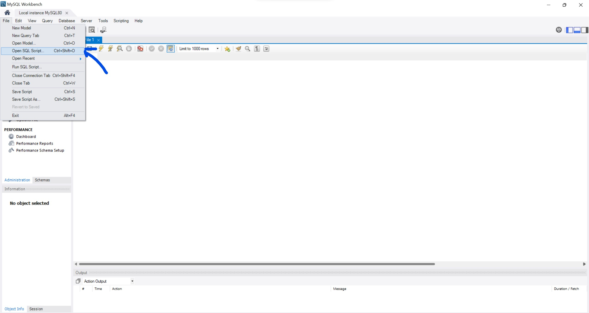
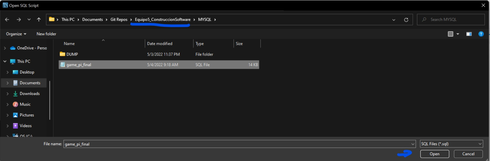
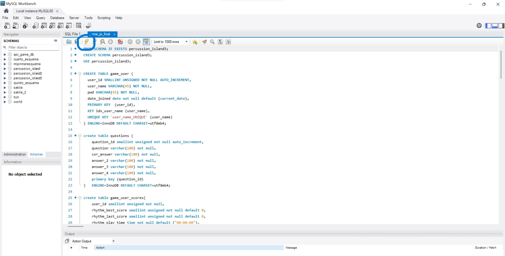
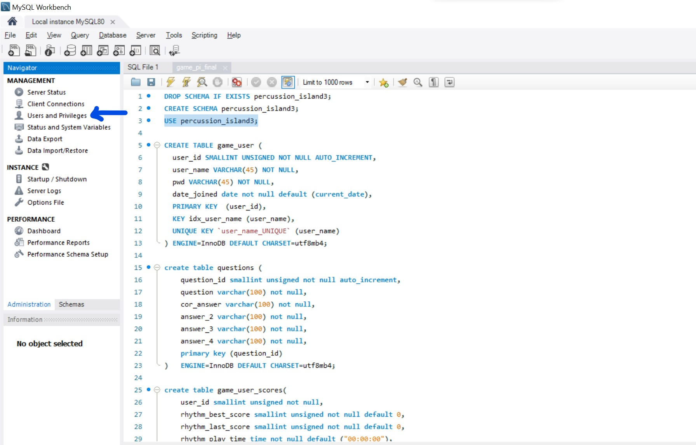
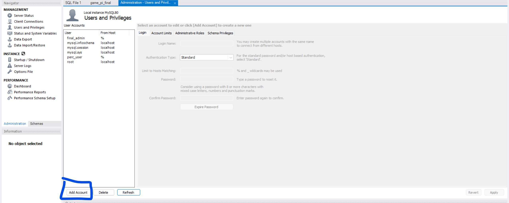
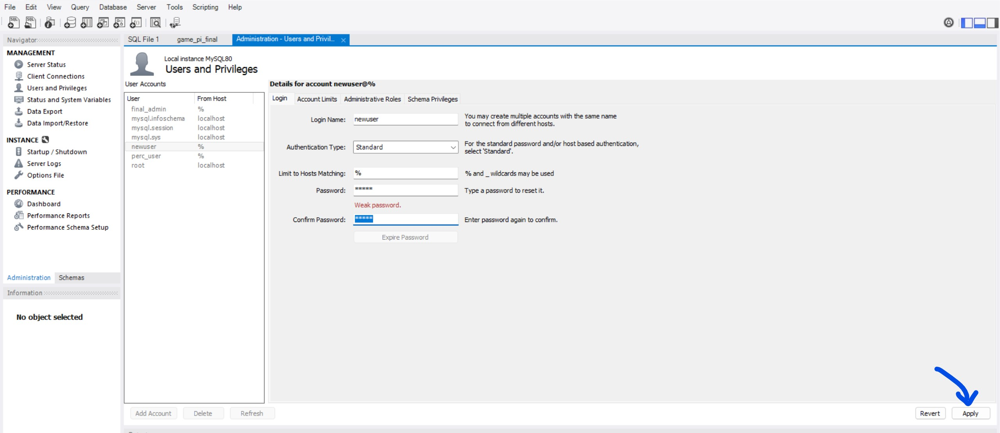

# Equipo5_ConstruccionSoftware

Video describing the game: https://drive.google.com/file/d/16rGMSU2RxlF3mPcDeFqp5GPhbFm0uyQj/view

---

# Installation and execution instructions

### **Using GitHub**
For those who don't have enough experience using GitHub directly on the terminal, we highly recommend using GitHub Desktop to clone or fork the repository.

Link with the installation process: https://desktop.github.com

Cloning and forking repositories from GitHub Desktop: https://docs.github.com/es/desktop/contributing-and-collaborating-using-github-desktop/adding-and-cloning-repositories/cloning-and-forking-repositories-from-github-desktop

### **Installing Node Js and MySQL Workbench**

Once the repo has been cloned or forked correctly, it is time to install MYSQL Workbench and Node js.

Node js Installation process: https://docs.npmjs.com/downloading-and-installing-node-js-and-npm. 

**IMPORTANT** - It is necessary to mention that this project contains a package.json with the node modules used for this project. You must install these modules before testing the API.

Link to install node module form package.json file: https://docs.npmjs.com/downloading-and-installing-node-js-and-npm

MySQL Workbench installation guide: https://www.youtube.com/watch?v=u96rVINbAUI

---

# Creating a User Admin from MySQL Workbench

In order to utilize the various API call to select, update or delete information from the database it is important to configure the user_admin privileges for that specific database. 

### **Running the script**

1) Open MySQL Workbench and select the local instance created in the installation process

2) Click the File Option and select 

3) Select the Folder of the repo and select the MySQL folder. Once inside select game_api_final and click on open.

4) Once opened it is important to excecute the script in order to create the database with the various tables, views and stored procedures.

5) Once executed you can then select the line of use percussio_island3 to select the database.

### **Creating the user**

Now that we have successfully created our database locally we must create a user that will have the privilege of selecting, updating, and viewing required in our API calls.

1) Inside MySQL Workbench click on the Administration Tab and select User and privilieges.

2) Click on the tab **Add Acount** in order to register a new user.

3) Type the name of the user as well as its password. Write this information somewhere place so we can access it easily during the API configuration. Once finished click on the Apply tab.

---

Repositorio para el proyecto del equipo 5 de Construcción de Software y Toma de Desiciones
- Andrés Briseño Celada - A01352283
- Salvador Salgado Normandia - A01422874
- Iván Rodríguez Cuevas - A01781284
- Iwalani Amador Piaga - A01732251

---

# Useful references

- MIDI rhythm game tutorial: https://www.youtube.com/watch?v=ev0HsmgLScg
- MIDI Rhythm game repo: https://github.com/SkyanSam/RhythmGameTutorialProject
- Two buttons rhythm game: https://www.youtube.com/watch?v=89KpbT_7Ysg
- Top down Pokémon-like RPG tutorials: https://www.youtube.com/playlist?list=PLLf84Zj7U26kfPQ00JVI2nIoozuPkykDX
- Top down tileset: https://jamiebrownhill.itch.io/solaria-rural-village
- MIDI editor (LMMS): https://lmms.io/download#windows
- Percussion Library: https://philharmonia.co.uk/resources/sound-samples/

# Asset credits
- Menu SFX: https://souptonic.itch.io/souptonic-sfx-pack-1-ui-sounds
- Character sprite sheets:https://jamiebrownhill.itch.io/solaria-sprites
- World tileset sprite sheets: https://jamiebrownhill.itch.io/solaria-rural-village
- Interior tileset sprite sheets: https://jamiebrownhill.itch.io/solaria-quiet-cabin
- Snare drum art: https://opengameart.org/content/snare-drum

# Script sources
- RPG part of the game is heavily based on this tutorial series by Game Dev Experiments: https://www.youtube.com/playlist?list=PLLf84Zj7U26kfPQ00JVI2nIoozuPkykDX

# Information sources
- Trivia game information sources: https://vicfirth.zildjian.com/education/percussion-101.html
