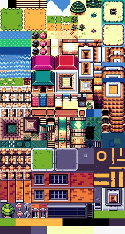

# **Percussion Islands**

## _Game Design Document_

---

##### **Copyright notice / author information / boring legal stuff nobody likes**

Particpants
- Andrés Briseño Celada - A01352283
- Salvador Salgado Normandia - A01422874
- Iván Rodríguez Cuevas - A01781284
- Iwalani Amador Piaga - A01732251

##
## _Index_

---

1. [Index](#index)
2. [Game Design](#game-design)
    1. [Summary](#summary)
    2. [Gameplay](#gameplay)
    3. [Mindset](#mindset)
3. [Technical](#technical)
    1. [Screens](#screens)
    2. [Controls](#controls)
    3. [Mechanics](#mechanics)
4. [Level Design](#level-design)
    1. [Themes](#themes)
        1. Ambience
        2. Objects
            1. Ambient
            2. Interactive
        3. Challenges
    2. [Game Flow](#game-flow)
5. [Development](#development)
    1. [Abstract Classes](#abstract-classes--components)
    2. [Derived Classes](#derived-classes--component-compositions)
6. [Graphics](#graphics)
    1. [Style Attributes](#style-attributes)
    2. [Graphics Needed](#graphics-needed)
7. [Sounds/Music](#soundsmusic)
    1. [Style Attributes](#style-attributes-1)
    2. [Sounds Needed](#sounds-needed)
    3. [Music Needed](#music-needed)
8. [Schedule](#schedule)

## _Game Design_

---

### **Summary**

The primary concept of the game is to incentivize the players to learn about percussive instruments and their importance in music. Some of the ideas presented in the game are: identifying the different percussion instruments their uses, forms and rhythms. 

By traveling through the islands and completing mini-games, the player will unlock various percussive instruments that open new paths to explore.

The genre of the game is a pokemon-style RPG, divided into islands containing many houses that represent sections to learn (rhythm, note and sound recognition, instruments...) they will not be demanding in terms of the use of keys and agile movements with the mouse, addition to be friendly, interactive and intuitive for anyone who wants to learn about percussion.

### **Gameplay**
The gameplay is going to be divided into diferent kinds. The main one is going to be a Pokémon-like RPG exploration inside a tiled map, where the player explores diferent islands and interacts with NPC's and instruments. 

Then, each island is going to have different kinds of minigames, such a trivia relating to information regarding percussion. Another one would be a rhythm game where the player has to play the right notes at the right time. 

On the other hand there are also mini-games that encourage the recognition of the sound of different instruments, these are the 2 mini memory games, where the dynamics are different but the purpose is the same. 

### **Minigames**

- Trivia (Learn important topics about percussion instruments)
- 2 Memory Games (Identify sounds and notes)
- Rhythm Game (percussion instruments)

### **Mindset**

One of the main goals of Percussion Island is to generate genuine interest of the player in learning more about percussion instruments. This is why we intend a Mindset of awe and joy of the player during gameplay that will provoke more interest in the learning aspect.

When the player is navigating the map, we want to provoke a calming feeling, because of the island theme. We also want to make the player curious so they explore all the game has to offer, from finding the different instruments as well as interacting with the NPC's.

During the minigames, we want to pressure the player a little bit, because that's where they get tested on their knowledge.

## _Technical_

---

### **Screens**

1. Title Screen
    1. login / register user 
2. Game
    1. Inventory
    2. Trivia Game
    3. Rhythm Game
    4. Memory Games
    4. Main screen (map navigation)
3. End Credits

### **Controls**

Movement is determined by 'W','A','S','D'. You can interact with NPC's by pressing the 'I' key. Also you can enter buildings by running into the doors.

The pause menu is opened with the escape key, it's navigated with 'W','A','S','D', things are selected with 'I' and you go back with 'O'. 

**Trivia Mini-Game**

When you start the game the question will appear and below it the available options, to select an answer use the mouse and press on the box containing the option 

**Rythm Mini-Game**

The game will count with two keys that have to be clicked depending on the notes displayed on the screen. More precision on the click will allow for more points. The idea is to use the A and D keys to hit the notes.

**Memory Mini-Game**

- Recognition of the sound each instrument makes
This game has similar mechanics as Trivia, in which the player can select the different cards with the mouse. Once the player wants to flip a specific card, he must click on. Once this occurs it may occur two actions:
1. The card is a type "Sound", in that it will produce a specific instrument sound
2. The card is a type "Visual", in which it will show an image of an instrument
Once the player identifies the card, he needs to choose a new one that is its type equivalent.

- Sequence memorization 
the second memory game shows you a sequence that you must remember so that you can replicate it while listening to the sounds that the instruments make. 
The mechanic is similar to the previous memory game, you must use the mouse and press on the element according to the sequence shown on the screen. 

### **Mechanics**

- General mechanics:
    - The player can to move in the four cardinal points. 
    - When the player gets near a building it can enter the building.
    - Also when the player is near an NPC you can talk to it.
    - If an obstacle blocks the way but the challenge has not been solved, you cannot proceed to the next island.
    - You can interact with obstacles so they can move out the way.
    - Can be interacted with randomly placed instruments within the island.
    - If there are no obstacles on the bridges, the player can move to other islands. 
    - Instruments found on the island can be stored in the inventory.
    - Can be interacted with randomly placed instruments within the island. 
    - You can select instruments from the inventory to see their information.
    - There are non-interactive objects that block the way (structures, end of the island, trees, rocks...).

Mechanics of mini-games: 
- In case of losing the game, in all mini-games the player has the option to retry or return to the island map.
1. Memory 
    1. Recognition of the sound each instrument makes
    - Click on the instruments/notes (as appropiate) to generate the sound corresponding to the element.
    - If the elements are selected in the correct order, generate a melody with the selected sounds.
    - The intensity and speed at which the sounds are displayed increase upon successful completion of a sequence.
    2.Sequence memorization 
    - Click on the instruments (as appropiate) to generate the sound corresponding to the sequense.
    - If the sequence is followed correctly the level increases with a new element added to the sequence. 
    - Game is lost when the sequence is not followed correctly  
2. Trivia 
    - The answers are multiple choice, the player must select one of the answer boxes corresponding to the question.
    - At the end you will find a box to send the answers. 
3. Rhythm 
    - According to the letters selected on the keyboard, the player must press the corresponding key at the moment. 
    - As the correct hits are made, the sounds generated by the note are heard.
    - if the player does not make a hit or presses the wrong key no sound is generated (sound muffled).

Are there any interesting mechanics? If so, how are you going to accomplish them? Physics, algorithms, etc.

## _Level Design_

---

### **Themes**

1. HUB Island
    1. Mood
        1. Tropical, calm
    2. Objects
        1. _Ambient_
            1. Trees
            2. Rocks
            3. Sand
            4. Buildings
            5. Water
            6. Grass
            7. Fish
            8. Lily pads
            9. Birds
            10. Bonfire
            11. Dock
            12. Waterfall
            13. Jars
        2. _Interactive_
            1. NPC's
            2. Buildings
            3. Obstacles (Birds)
2. First Island
    1. Mood
        1. Calm, urban
    2. Objects
        1. _Ambient_
            1. Roads
            2. Buildings
            3. Trees
            4. Grass
            5. Plants
            6. Jars
            7. Water
            8. Birds
            9. Books
            10. Rocks
            11. Crates
            12. Pond
        2. _Interactive_
            1. NPC's
            2. Buildings

3. Rythm Mini Game
    1. Mood
        1. Tropical, calm
    2. Objects
        1. Ambient
            1. Music sheet
            2. Background image
        2. Interactive
            1. Rythm arrows
     

3. Memory Mini Game
    1. Mood
        1. Tropical, calm
    2. Objects
        1. Ambient
            1. Background image
        2. Interactive
            1. Instrument image
            2. Instrument sound

### **Game Flow**

1. Player starts in the island hub at the dock
2. Must move upward to encounter the first NPC.
3. Player talks to the NPC and the NPC tells him to go to the house to the left and enter it.
4. Player moves upward, then to the left to encounter the house and enter it.
5. Player talks to the NPC at the house, the NPC explains the percussion instruments and gives the player any instrument (for example "Drums" acquired). Then the NPC tells him to go to the first percussion island located at the right.
6. Player exits the house and walks to the right.
7. Player encounters the first obstacle (birds at the dock) so the player must have the required element to be able to cross (collectable instrument from the inventory).
8. Player arrives to the first percussion island
9. Player talks to the NPC that will explain him the basics of the island.
10. Player moves to the right in order to get to the edge of the island.
11. Player moves upward in order to encounter the music store.
12. Player enters music store.
13. Player talks to the NPC at the music store, the NPC explains the different sounds of percussion instruments.
14. Player walks out of the music store, and explores the map in order to find a red house (Player must move downward and to the left).
15. Player moves upward in order to encounter the red house and enter it.
16. Player talks to the NPC at the red house and plays the first mini game, where the player must recognize the different instruments sounds.
17. Player is awarded a ...(still in development)... ("..." acquired).
18. Player walks out of the house and moves down to the vegetable patch.
19. Player talks to the NPC at the vegetable patch.
20. Player plays the ...(still in development)... to help the vegetables grow.
21. Player talks again to the NPC and tells him to go to the blue house.
22. Player moves upward and to the right, then downward, in order to encounter the blue house.
23. Player enters the blue house.
24. Player talks to the NPC and his final mini game at the island begins.
25. Player plays the rythm game.
26. Player talks to the NPC and gives him ...(still in development)... ("..." acquired).
27. Player exits the house.
28. Player moves upward and to the left.
29. Player exits the island and comes back to the hub island.
30. Player moves to the left and encounters the second obstacle (still in development).

## _Development_

---

### **Abstract Classes / Components**

1. BasePhysics
    1. BasePlayer
    2. BaseNPC
    3. BaseObject
2. BaseObstacle
3. BaseInteractable
4. BaseInvetory

### **Derived Classes / Component Compositions**

1. BasePlayer
    1. PlayerMain
    2. PlayerUnlockable
2. BaseNPC
    1. KeyNPC
    2. FillerNPC
3. BaseObject
    1. ObjectInstrument (pick-up-able, playable, key item)
    2. ObjectJournal (given by NPC, openable through inventory screen)
4. BaseObstacle
    1. ObstacleBirds (moved with first instrument)
    2. ObstacleWall (includes houses, trees and other structures)
    3. ObstacleWater (defines the bounds of the map)
5. BaseInteractable
    1. InteractableInstrument (non-pick-up-able, produces sound when interacted with)

## _Graphics_

---

### **Style Attributes**

For this game, we are using as primarly inspiration the classic Pokemon RPG games, which most of the time use vibrant and joyful colors. To truly make the esthetic of the game as consistent as possible, we are going to define specific colors on our sprites that must match in every section of the game.

Graphic-wise, we decided to create a 2D RPG pixel game. Not only this style will allow us to improve on other aspects of the game (minigames, soundtrack) but also provoke a relaxing gaming experience. 

Most of the learning of percussion instruments will be in the various minigames. With that said, this section must be well developed to incentivize the players to keep learning and playing.

### **Graphics Needed**

Top down RPG

1. Characters
    1. Human-like
        1. Main character (idle, walking, item get)
        2. NPC villagers (idle, walking)
    2. Other
        1. Birds (toucans) (idle, flying)
2. Ground layer 
    1. Dirt
    2. Dirt/Grass
    3. Stone Block
    4. Stone Bricks
    5. Wooden Floor
    6. Dirt Path
    7. Rocky shores
    8. Bridges
    9. Brick floor
    10. Water (with current, fishes, lily pads, rocks)
    11. Flowers
3. Ambient
    1. Tall Grass
    2. Tree stumps
    3. Vines
    4. Berries
    5. Trees
    6. Berry bushes
    7. Campfires
    8. Logs
    9. Benches
    10. Wooden signs
    11. Barrels
    12. Pots
    13. Crops (carrots, watermelons)
4. Structures
    1. Houses
    2. Market stands
    3. Sign posts
    4. Well
5. Inside houses
    1. Tables
    2. Chairs
    3. Counters
    4. Drawers
    5. Carpets
    6. Kitchen sink
    7. Paintings
    8. Potted plants
    9. Books
6. Other
    1. Chest
    2. Door (open and closed)
    3. Windows
    4. Chimneys (can have animated smoke)
    5. Roofs
    6. Market goods (food in crates, on the stands)
    7. Instruments (Interactibles and pick-up-ables)
 
 Trivia mini game
 1. Dialogue boxes
    1. Selection arrow
    2. Box border
    3. Text font

Memory game
1. Memory tiles
    1. Flipped tiles
    2. Sound tile (Speaker icon)
    3. Instrument tile (Icons for every instrument: xylophone, marimba, snare, congas, etc.)
    4. Highlight border

Rhythm game
1. UI
    1. Note lane
    2. Success zone indicator
    3. Point counter
    4. Success/Fail text
    5. Background
2. Gameplay elements
    1. Right note icon
    2. Left note icon

Main menu
1. Start button
2. Quit button
3. Background
4. Title logo

## _Sounds/Music_

--- 

### **Style Attributes**

The main objective of our game is to teach the players about the different types of percussion instruments and their importance in music. With this in mind, it is vital to include music that utilizes this type of instrument. The rhythm minigame will have various songs, in which percussion instruments are in the main spotlight. 

For the background music played while the player explores the map, we are going to use songs that resemble the relaxing atmosphere of the famous game Animal Crossing.

### **Sounds Needed**

1. Effects
    1. Chest Opening
    2. Door Opening
    3. Menu navigation (move and confirm)
    4. Dialogue interaction (confirmation sounds) 
    5. Instrument samples (snare, xylophone, marimba, etc.)
    6. Birds getting scared
    7. Ambient water and air
2. Feedback
    1. Happy chime (item get)
    2. Progression success (ex. scaring birds)

Possible Musical notes:
1. playable instrumets:
    - Xilophone
    - Marimba
    - Bongo
    - Snare 
2. Non-playable instruments:
    - Triangle
    - Gong
    - Maracas or Castanets
    - Tambourine
    - Box 

### **Music Needed**

Main inspiration: pokemon, animal crossing, stardew valley

- Title theme (adventurous)
- Hub island theme (pokemon first town inspired)
- First island theme (normal Pokémon/Animal Crossing inspired)
- House theme (calm house RPG music)
- Trivia game theme (upbeat)
- Rhythm game theme (we'll use our own MIDI samples)
- Memory game theme (calm, helps focus)

## _Schedule_

Estimated times 

1. develop base classes   -  2 Days 

    1. Base Physics 
    2. Base Player 
    3. Base NPC 
    4. Base Obstacle 
    5. Base Interactable 
       
2. base app state  -- 2 Days 
     1. Intoduction to the game (Explation-title screen) 
     2. Hub (principal island) 
     3. Secondary islands (activities) 
           - Zone to learn, museum
           - Memory and rhythm minigames
      4.  Game state
            - Start game 
            - Game over 
            - Game winner 
            - Credits game
3. develop player and basic block classes -- 5 Days 
    1. BasePlayer
       1. PlayerMain
       2. PlayerUnlockable
    2. BaseNPC
       1. KeyNPC
       2. FillerNPC
    3. BaseObject
       1. ObjectInstrument (pick-up-able, playable, key item)
       2. ObjectJournal (given by NPC, openable through inventory screen)
    4. BaseObstacle
       1. ObstacleBirds (moved with first instrument)
       2. ObstacleWall (includes houses, trees and other structures)
       3. ObstacleWater (defines the bounds of the map)
    5. BaseInteractable
       1. InteractableInstrument (non-pick-up-able, produces sound when interacted with)
4. find some smooth controls/physics  -- 5 Days 
    1. Movement ("WASD")
    2. Interaction with NPC´s 
    3. Entering and leaving houese/rooms 
    4. Return to the previus screen
    5. Interaction with mini games 
    6. Interaction with instruments 
    7. Inventory instrument selection inventory 
    9. Indentifiy keys inside the minigames  
    10. Obstacles blocking the way to the islands 
   
5. develop other derived classes  -- 5 Days 
    1. Mini-games 
        1.  memory 
           - Select element 
           - Generate sounds 
           - Show notes 
        2. Trivia
          - Generate question 
          - Select answer  
          - Show qualification 
        3. Rhythm
          - Generate tone 
          - Show notes 
          - Determination of keys 
          - Hits 
     
6. design levels -- 10 days 
    1. Introduce movement in character 
    2. Principal isaland (Hub) 
    3. Introduction to game (Firts interaction with NPC´s) 
    4. Interacting with structures (leaving and entering houses)
    5. Interior designs of the first houses  
    6. Interaction to the islands (effects and designs)
    7. Crossing to other islands 
    8. First obstacle 
    9. Minigames in secondary island 
    10. Others interactions with NPC´s 
    11. Enemies blocking the way 
    12. Instruments around the islands 
    13. Generate inventary 
    
7. design sounds -- 3 Days 
    1. Background sounds 
        1. fire sounds
        2. waves / water in motion 
        3. bird sounds
        4. air /tree movement 
        5. Chest Opening
        6. Door Opening
        7. Menu navigation (move and confirm)
        8. Dialogue interaction (confirmation sounds) 
    2. Effects  
       1. Collision (blocked structures) 
       2. Selection (in menu bar / instruments inventory)
       3. Recolection of new item (sound of the new instrument)
    3. Feedback
        1. Happy chime (item get)
        2. Progression success (ex. scaring birds)
    4. Instruments notes
        1. playable instrumets:
            - Xilophone
            - Marimba
            - Bongo
            - Snare 
        2. Non-playable instruments:
            - Triangle
            - Gong
            - Maracas or Castanets
            - Tambourine
            - Box 

8. design music  -- 3 Days 
     1. Initial music (title music)
     2. Island music (while the player is navigating the map)
     3. Rooms music (inside the rooms) 
     4. Credits music 
     5. Mini-games musics
        1. Memory (series of notes)
        2. Rhythm (Percussion tones)
